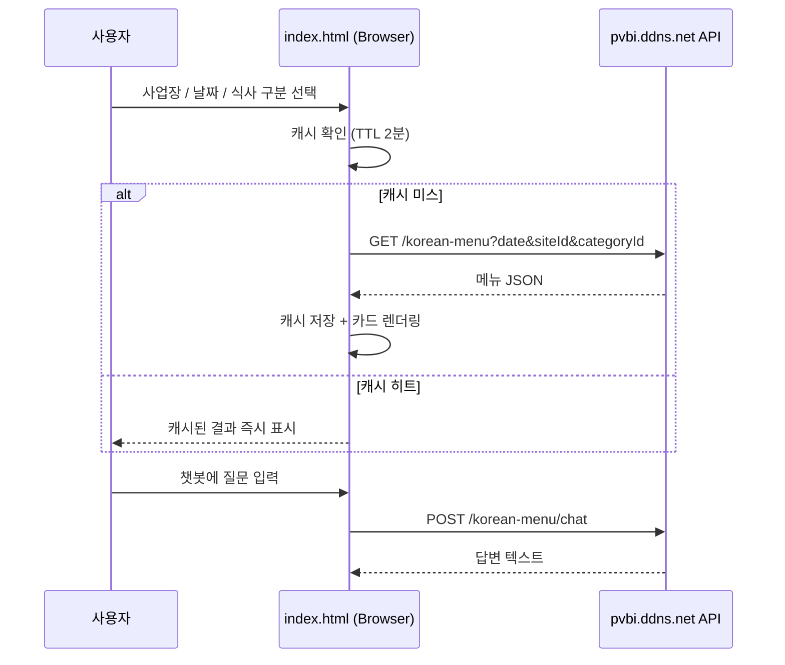

<div align="center">

# 🍚 Promiseon Vina Korean Menu

**베트남 현지 사업장 임직원을 위한 한식 식단 안내 서비스**

외부 급식 API에서 실시간 메뉴 데이터를 받아와 사업장·날짜·식사 구분별로 보여주는
정적(static) 프론트엔드입니다. 별도 백엔드나 빌드 과정 없이 `index.html` 하나로 동작합니다.

[](https://promiseonvina.github.io/)


</div>

---

## Overview

이 프로젝트는 베트남 현지에 진출한 사업장들의 **주간 식단표를 조회하고, 궁금한 점을 챗봇에게
물어볼 수 있는** 사내용 웹 페이지입니다. 서버 로직 없이 브라우저에서 직접 외부 REST API
(`https://pvbi.ddns.net/api/korean-menu`)를 호출하는 **API 소비 전용(consumer-only) 프론트엔드**로,
GitHub Pages 정적 호스팅만으로 배포·운영됩니다.

## Features

| 기능 | 설명 |
| --- | --- |
| 📅 **메뉴 필터링** | 사업장 · 날짜 · 식사 구분(조식/중식/석식/야식) 조합으로 당일 메뉴 조회 |
| 🗂️ **주간 식단 보기** | 모달에서 한 주 전체 식단을 표 형태로 한눈에 확인 |
| 💬 **메뉴 챗봇** | `quikchat` 기반 챗 UI로 식단 관련 질의응답 API 연동 |
| 🌐 **한국어 / 베트남어** | 버튼 한 번으로 UI 전체 언어 전환 (i18n) |
| ⚡ **캐시 + SWR** | 조회 결과를 2분 TTL로 캐시하고, `AbortController`로 중복·경쟁 요청 정리 |
| 📱 **반응형 레이아웃** | 모바일 현장 근무자 기준으로 최적화된 카드형 UI |

## Tech Stack

정적 페이지지만 프론트엔드 성능·UX를 위해 아래 라이브러리들을 선별적으로 사용합니다
(`assets/vendor/`에는 과거 테마의 부산물로 더 많은 라이브러리가 남아있으나, 실제 로드되는 것은 아래가 전부입니다).

- **Markup / Style** — HTML5, Bootstrap 5, Bootstrap Icons, Google Fonts(Noto Sans KR)
- **Chat** — [quikchat](https://github.com/rmariuzzo/quikchat)
- **Date** — Moment.js (`ko` locale)
- **Flags** — flag-icon-css (언어 전환 버튼)
- **Analytics** — Google Analytics (gtag.js)
- **Data** — 외부 REST API (`X-API-KEY` 헤더 인증)

## How It Works



## Project Structure

```
.
├── index.html          # 애플리케이션 전체 (마크업 + 스타일 + 로직)
├── assets/
│   ├── css/             # 커스텀 테마 스타일
│   ├── js/               # 커스텀 스크립트
│   ├── favicon/          # 파비콘 세트
│   ├── img/               # 이미지 리소스
│   └── vendor/           # 서드파티 라이브러리 (Bootstrap, quikchat 등)
├── old/                  # 이전 버전 index.html 스냅샷 (백업용)
└── AGENTS.md             # AI 코딩 에이전트를 위한 작업 가이드
```

## Getting Started

빌드 도구가 필요 없으므로 정적 서버로 열기만 하면 됩니다.

```bash
git clone https://github.com/promiseonvina/promiseonvina.github.io.git
cd promiseonvina.github.io

# 아무 정적 서버로 실행 (예시)
npx serve .
# 또는
python3 -m http.server 8080
```

브라우저에서 `http://localhost:8080` 접속 후:

1. 상단 드롭다운에서 **사업장** 선택
2. 날짜 선택 → **조식/중식/석식/야식** 버튼으로 식사 구분 필터링
3. 메뉴 카드 상단의 **주간 식단 보기** 버튼으로 한 주 전체 식단 확인
4. 우측 하단 챗봇 아이콘으로 메뉴 관련 질문
5. 언어 버튼(KR/VN)으로 전체 UI 언어 전환

> ⚠️ `index.html` 내 `API_BASE`는 사내 API 서버 주소로 고정되어 있어, 별도 백엔드 설정 없이도
> 바로 실제 데이터가 표시됩니다. 다른 API로 연동하려면 `API_BASE` / `API_KEY` 상수만 수정하면 됩니다.

## Deployment

`main` 브랜치에 정적 파일을 커밋하면 GitHub Pages가 자동으로 [promiseonvina.github.io](https://promiseonvina.github.io/)에 반영합니다. 별도의 CI/빌드 파이프라인은 없습니다.

## Contributing

이 저장소에서 작업하는 사람 · AI 에이전트 모두 [`AGENTS.md`](./AGENTS.md)의 가이드를 우선 확인해 주세요.
